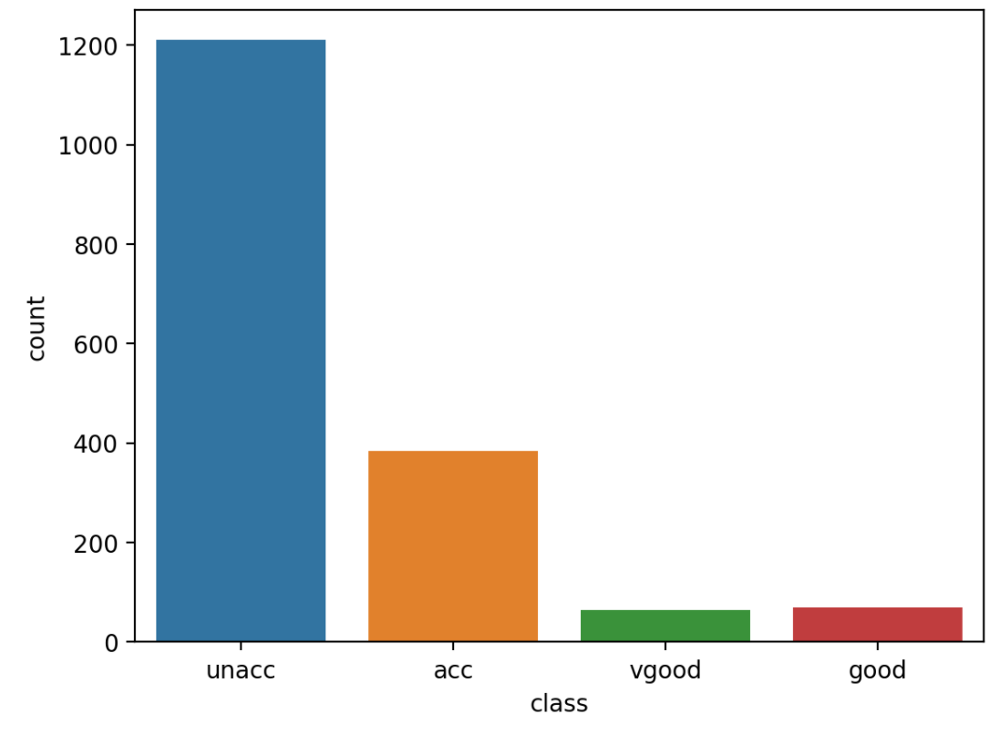
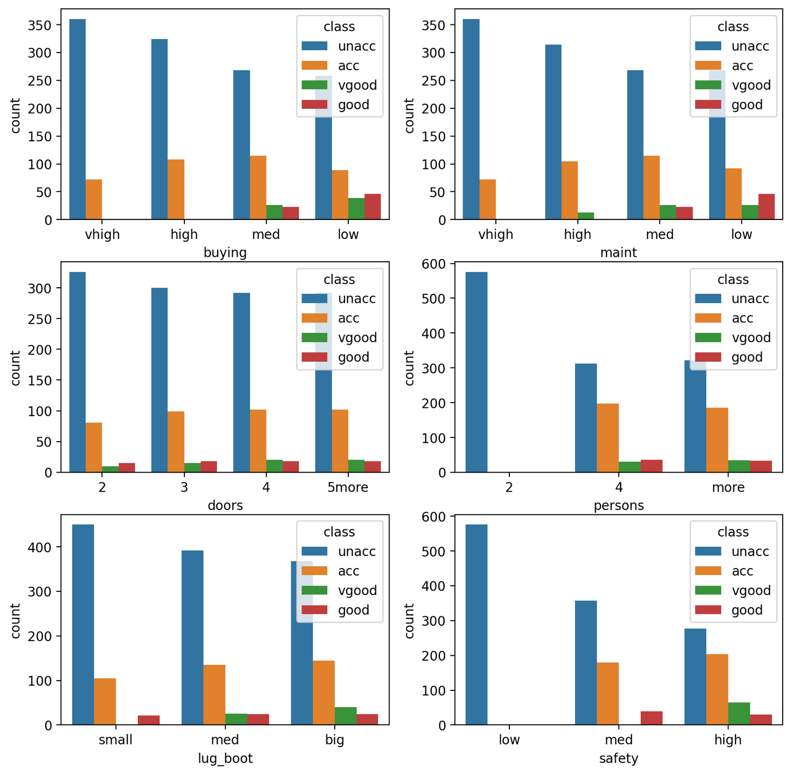
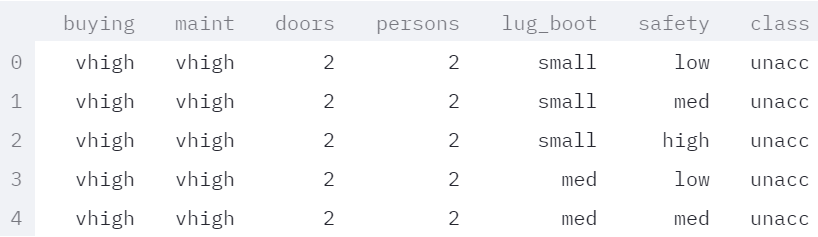
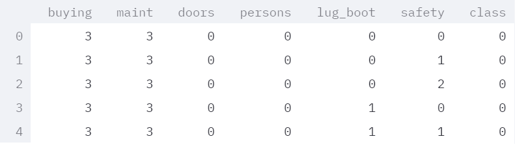
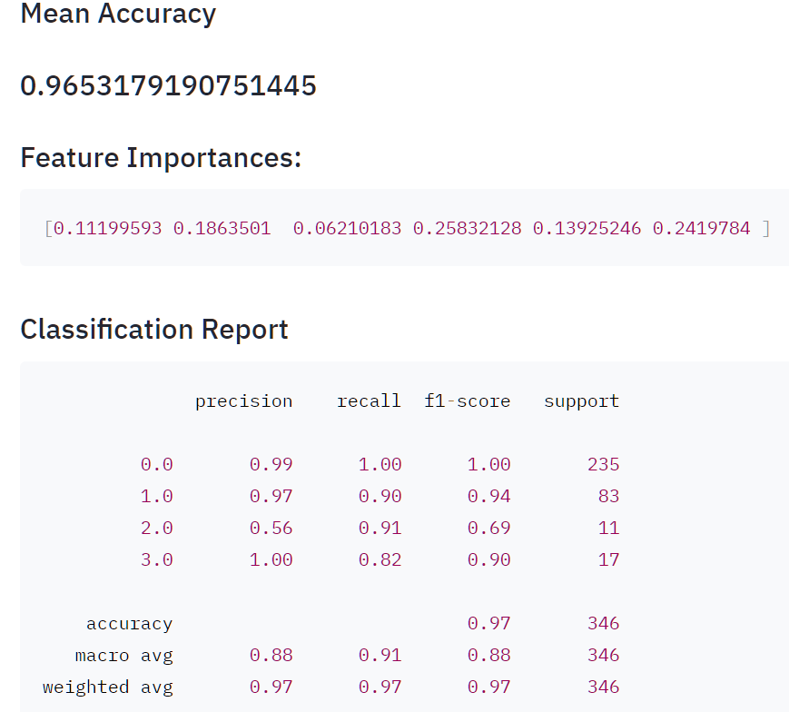
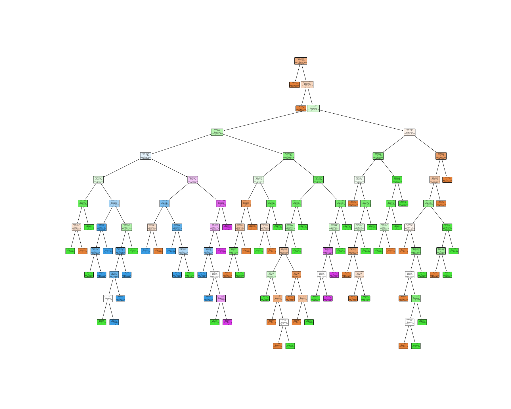
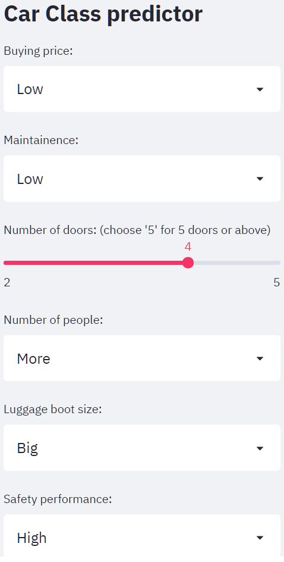
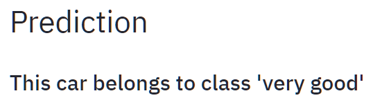

# Exercise-Streamlit App on Car class dataset

## Objective
This is an exerccise on create a data app on Streamlit for Decision Tree Classifier model. The model is a car class prediction model which predict the car class base on the buying price, maintainence price, number of doors, number of seats, luaggage boot size and safety level. 

'car_app' is code for the Streamlit app
'develop_model' is code for the python program, include fine tuning of model and visualize the model. 

Data is from kaggle dataset: https://www.kaggle.com/elikplim/car-evaluation-data-set

## Data Exploration 

### Univariate data anlysis
Imbalance of data - Majority of the cars are classified as 'unacc' and few cars are in the class of 'vgood' and 'good'.

### Bivariate data analysis
Cars that can be classified as 'vgood' or 'good' normally with a medium or low buying price and maintenance fee. The cars should be 4-seater or above and with a medium or big luggage truck, and high safety level.

## Data_Preprocessing
Before preprocessing:

There is no missing value in the data.
All columns are categorical and with the degree listed as below. Columns are encoded to numerical according as the order in the list below. 
buying :    ['vhigh' 'high' 'med' 'low']
maint :     ['vhigh' 'high' 'med' 'low']
doors :     ['2' '3' '4' '5more']
persons :   ['2' '4' 'more']
lug_boot :  ['small' 'med' 'big']
safety :    ['low' 'med' 'high']
class :     ['unacc' 'acc' 'vgood' 'good']

After preprocessing: 

## Decision Tree Classifier

### Model preformance

### Visualization

## Predictor
A predictor is created on Streamlit app. An example of prediction. 

### Result:

